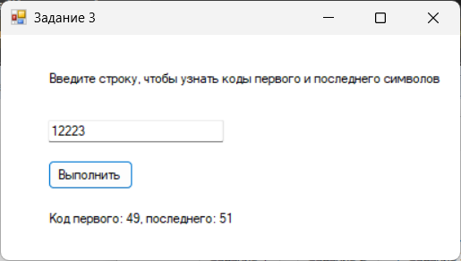

# День 8-11

---
### Интерфейс главной формы (Form1.cs)

Название проекта: `DAYS 8-11`, название файла формы `Form1.cs`

---

### Инструментарий

| Объект              | Свойство `Name` | Свойство `Text`    |
|---------------------|-----------------|--------------------|
| **Форма**           | `Form1`         | День 8-11          |
| **Кнопка**          | `button1`       | Задание 1          |
| **Кнопка**          | `button1`       | Задание 2          |
| **Кнопка**          | `button1`       | Задание 3          |
---
## Первое задание (Form2.cs)

### Описание задания:
Вывести строку длины N (N — четное), которая состоит из
чередующихся символов C1 и C2, начиная с C1

---

### Интерфейс формы первого задания (Form2.cs)

Название файла формы `Form2.cs`

---

### Инструментарий

| Объект              | Свойство `Name`        | Свойство `Text`                           |
|---------------------|------------------------|-------------------------------------------|
| **Форма**           | `Form2`                | Задание 1                                 |
| **Метка**           | `lblDescription`       | Введите длину строки (N), символы C1 и C2 |
| **Счётчик**         | `numLength`            |                                           |
| **Текстовое поле**  | `txtC1`                | A                                         |
| **Текстовое поле**  | `txtC2`                | B                                         |
| **Кнопка**          | `btnGenerate`          | Выполнить                                 |
| **Метка**           | `lblResult`            | Результат: ABA                            |
---
## Второе задание (Form3.cs)

### Описание задания:
Дана строка. Вывести строку, содержащую те же символы, но
расположенные в обратном порядке

---

### Интерфейс формы второго задания (Form3.cs)

Название файла формы `Form3.cs`

---

### Инструментарий

| Объект              | Свойство `Name`        | Свойство `Text`              |
|---------------------|------------------------|------------------------------|
| **Форма**           | `Form3`                | Задание 2                    |
| **Метка**           | `lblDescription`       | Введите строку для разворота |
| **Текстовое поле**  | `txtInput`             | Hello                        |
| **Кнопка**          | `btnGenerate`          | Выполнить                    |
| **Метка**           | `lblResult`            | Результат: olleH             |

---

---
## Третье задание (Form4.cs)

### Описание задания:
Дана строка. Вывести коды ее первого и последнего символа

---

### Интерфейс формы третьего задания (Form4.cs)

Название файла формы `Form4.cs`

---

### Инструментарий

| Объект              | Свойство `Name`        | Свойство `Text`                                                 |
|---------------------|------------------------|-----------------------------------------------------------------|
| **Форма**           | `Form4`                | Задание 3                                                       |
| **Метка**           | `lblDescription`       | Введите строку, чтобы узнать коды первого и последнего символов |
| **Текстовое поле**  | `txtInput`             | 12223                                                           |
| **Кнопка**          | `btnCodes`             | Выполнить                                                       |
| **Метка**           | `lblResult`            | Код первого: 49,последнего: 51                                  |